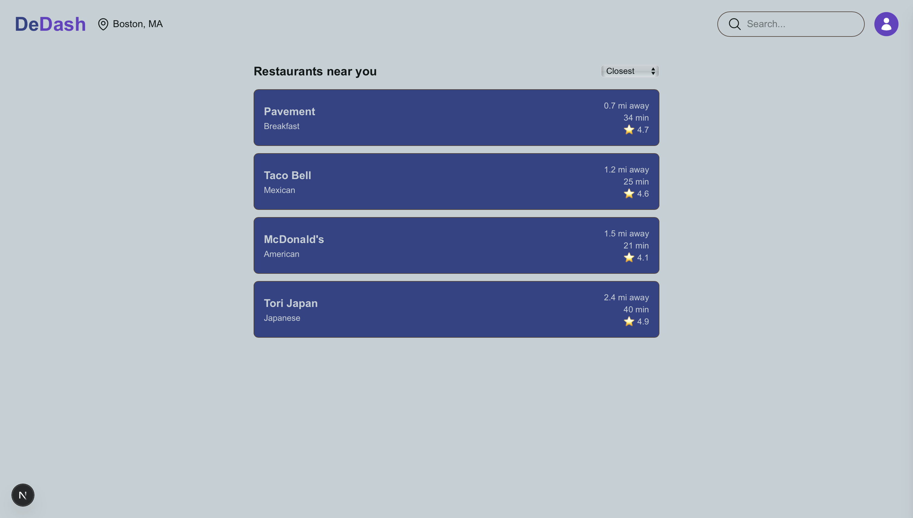
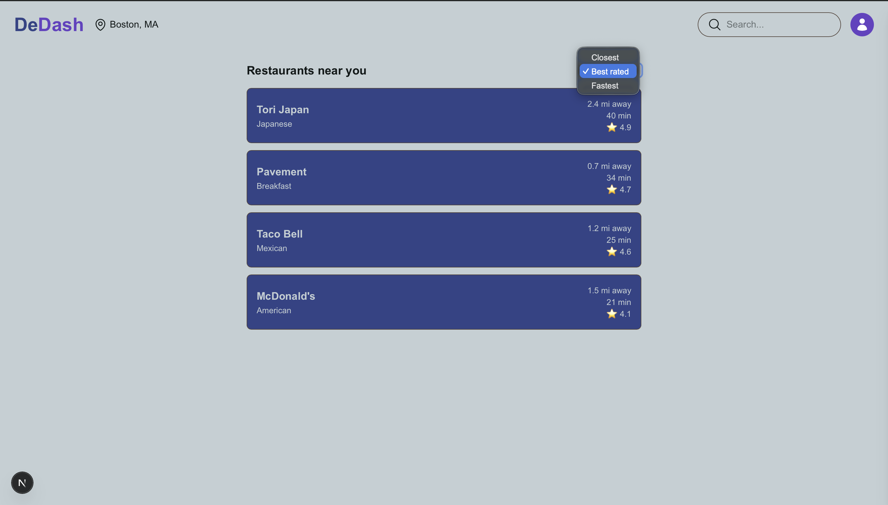
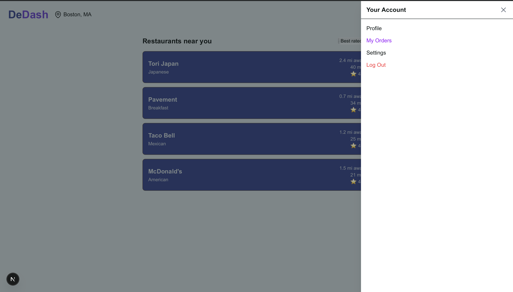

# DeDash
### Decentralized Food Delivery Service 🚚

**DeDash** aims to provide a decentralized solution to the fee-ridden market of food delivery.  Platforms such as *Uber Eats* and *DoorDash* are notorious for their hefty fees, taking a large percentage of user's payment from drivers.  **DeDash** looks to put money back into the pockets of customers and drivers.  

Using the concept of a *Dutch Reverse Auction*, customers set a starting, maximum cost that they are willing to pay for an order, and a maximum time interval that they are willing to wait.  

The price of the delivery is dynamic; it begins at the starting price selected by the user, and gradully increments towards their max price until the order is either picked up by a nearby driver or the time limit is reached, prompting the order to be cancelled and the funds refunded to the user.

Upon the submission of an order by a customer, the user-specified maximum price is withdrawn from the user's wallet, being held on the blockchain in escrow, ensuring the user has sufficient funds and guaranteeing the driver's payment upon successful delivery.  

After successful delivery, the driver is paid the agreed order amount and the customer is reimbursed for the money that was not spent in the transaction *(escrow - final price)*.

This decentralized approach grants power to both customer and driver in price setting, removing fees found in centralized systems.  Drivers' profits don't struggle and customers pay less overall due to the lack of fees.

### UI Overview

This is the main page of DeDash once the user logs in with their wallet, nearby restaurants are shown in a list in the middle with search functionality in the navbar above.

The nearby restaurants can be sorted by distance, reviews, or estimated time of delivery.

Users are also able to use the sidebar to view profile information such as past orders, change their settings, or log out.

### Technical Overview

DeDash uses blockchain technology to avoid the need of paying a middle man. We created a backend via the Foundary Forge and Solidity, then combined that with a frontend created with React, Next.js, and Tailwind.css.
